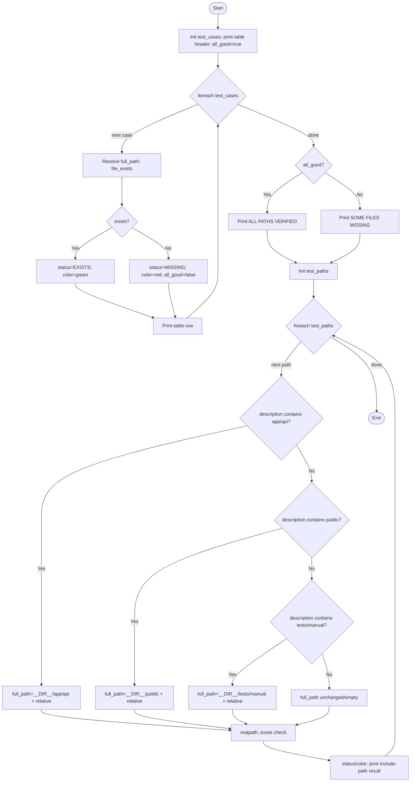

# Path Testing Graph and Cyclomatic Complexity

Date: 2026-02-23
Target Script: `path_verification_test.php`

## Control Flow Graph (CFG)

## Cyclomatic Complexity

### Method Used
Basis-path style count using explicit control-flow decisions (`if`, `elseif`, `foreach`):

- `foreach ($test_cases ...)` → 1
- `if (!$exists)` → 1
- `if ($all_good)` → 1
- `foreach ($test_paths ...)` → 1
- `if (strpos(... 'app/api/'))` → 1
- `elseif (strpos(... 'public/'))` → 1
- `elseif (strpos(... 'tests/manual/'))` → 1

Total decision points: **D = 7**

Cyclomatic complexity:

$$V(G) = D + 1 = 7 + 1 = 8$$

### Result
**Cyclomatic Complexity = 8**

This means at least 8 independent basis paths are needed for full basis path coverage of this script.
